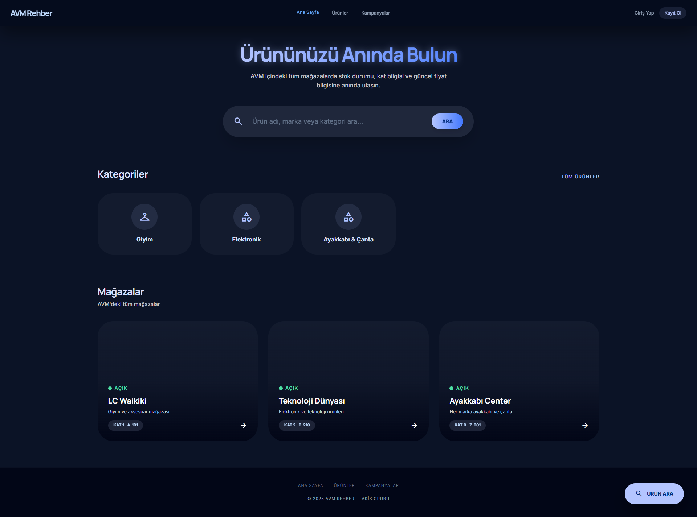
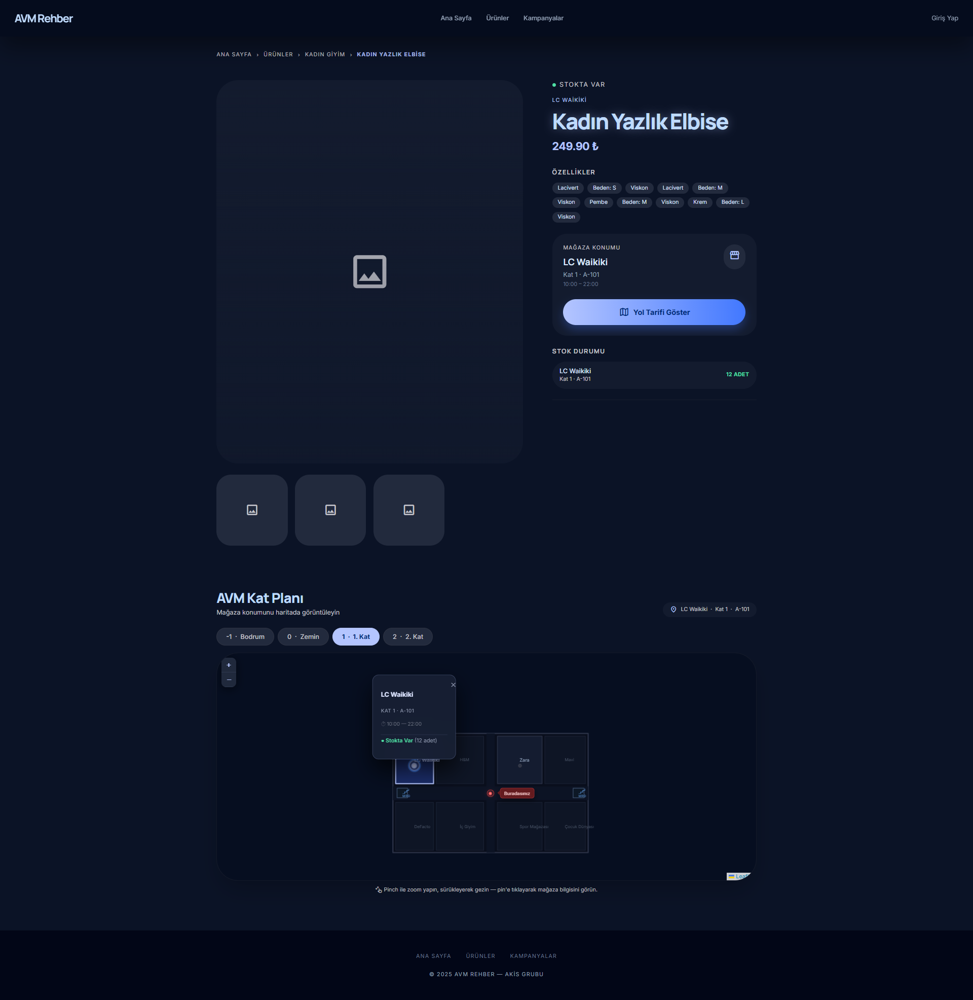
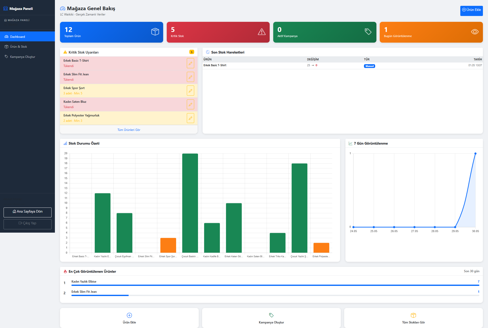
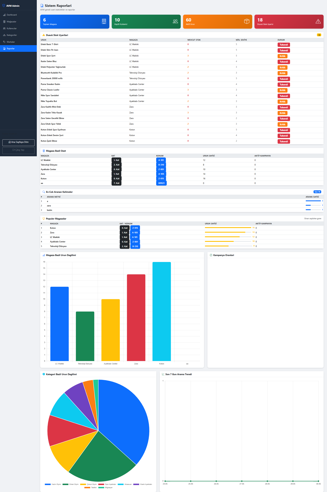
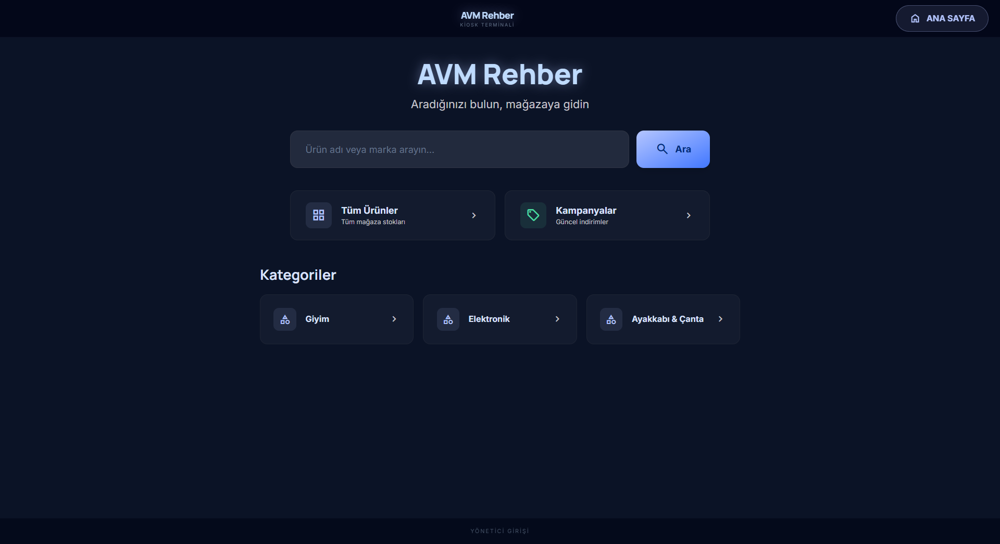
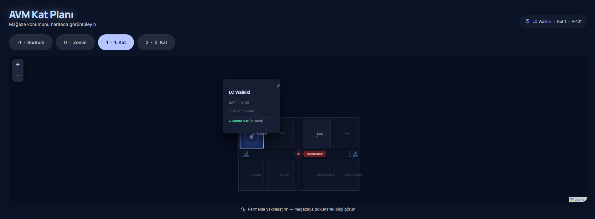

<div align="center">

# AKİS
### AVM İçi Akıllı Ürün Bulma · Stok Takip · Mağaza Yönlendirme Sistemi

[](https://python.org)
[](https://flask.palletsprojects.com)
[](https://sqlalchemy.org)
[](https://leafletjs.com)
[](LICENSE)

*Doğru ürünü, doğru mağazada, doğru zamanda müşteriyle buluştur.*

</div>

---

## Proje Açıklaması

**AKİS** (AVM İçi Akıllı Ürün Bulma, Stok Takip ve Mağaza Yönlendirme Sistemi), modern alışveriş merkezleri için geliştirilmiş tam kapsamlı bir web platformudur. Müşterilerin mağazadan mağazaya koşma sorununu ortadan kaldırır: ürünün hangi mağazada, hangi katta, stokta olup olmadığını gerçek zamanlı olarak gösterir; interaktif kat haritasıyla mağazaya yönlendirir; ürün yoksa stok girince bildirim gönderir.

Mağaza sorumluları özel panellerinden stoklarını yönetir ve kampanya tanımlar. AVM yöneticisi tüm sistemi merkezi admin panelinden kontrol eder. POS sistemleri güvenli REST webhook ile otomatik entegre olur.

---

## Projenin Amacı

| Sorun | AKİS Çözümü |
|---|---|
| Ürünün stokta olup olmadığını öğrenmek için mağazaya gitmek gerekiyor | Her ürün ve arama sonucunda anlık stok durumu |
| Hangi katta, hangi mağazada hangi beden bulunduğu bilinmiyor | Leaflet.js tabanlı interaktif 4 katlı AVM haritası |
| Stok tükenince müşteriyi haberdar edecek mekanizma yok | "Stok Gelince Haber Ver" sistemi — 24 saatlik tekrar engeli |
| Mağaza personeli stoku tablolarda yönetiyor | Anlık stok düzenleme ve denetim izi ile mağaza paneli |
| AVM yönetiminin sistem geneli görünürlüğü yok | Arama trendleri, popüler mağazalar, POS sync logları |

---

## Özellikler

<details>
<summary><b>Müşteri / Ziyaretçi</b></summary>

- Ürün adı ve marka bazlı tam metin arama
- Çoklu filtre: renk · beden · kumaş türü · fiyat aralığı · mağaza · hiyerarşik kategori
- Ürün detay sayfası: mağaza bazlı stok durumu, aktif kampanya fiyatı, kat ve konum bilgisi
- Leaflet.js tabanlı 4 katlı AVM haritası — pulsating pin + smooth fly-to animasyonu
- Stokta yok ürünler için "Haber Ver" modalı (BR-3.3: 24 saatte 1 talep)
- Aktif kampanya listesi

</details>

<details>
<summary><b>Kiosk Terminal Modu</b></summary>

- Dokunmatik arayüz — cursor gizli, büyük buton hedefleri, klavye gerektirmez
- 120 saniyelik hareketsizlik sayacı → animasyonlu geri sayım overlay → ana sayfaya otomatik yönlendirme
- Sayfalı ürün ızgarası (8 ürün / sayfa, 2 sütun)
- Haritada "Buradasınız" kırmızı pulsating nokta
- Bildirim formu yok (kiosk halka açık, paylaşımlı terminal)
- Diğer rollerden yalıtılmış kiosk oturumu

</details>

<details>
<summary><b>Mağaza Sorumlusu Paneli</b></summary>

- Mağazaya özel ürün listesi — satır içi hızlı stok güncelleme
- Tam ürün düzenleyici: ad, açıklama, görsel URL, marka, kategori, baz fiyat, minimum stok eşiği
- Çoklu varyant satırları: renk / beden / kumaş türü / ek fiyat
- Kampanya oluşturucu: ürün seçici + indirim yüzdesi + tarih aralığı seçici
- Dashboard KPI'ları: toplam ürün, düşük stok uyarıları, en çok görüntülenen ürünler (7 günlük çizgi grafik), son stok hareketleri

</details>

<details>
<summary><b>Sistem Admini Paneli</b></summary>

- Mağaza CRUD: kat, benzersiz konum kodu, çalışma saatleri, sorumlu atama
- Kullanıcı yönetimi: rol değiştirme, aktif/pasif yapma, modal ile şifre sıfırlama
- Hiyerarşik kategori ağacı düzenleyici (Ana → Alt → Torun)
- Marka yönetimi — soft delete
- Gelişmiş raporlar: en çok aranan 10 terim · popüler mağazalar · kategori dağılımı (pasta grafik) · 7 günlük arama trendi (çizgi grafik) · POS sync hata logu

</details>

<details>
<summary><b>POS Entegrasyonu (REST API)</b></summary>

- `POST /api/pos/stock-update` — `X-API-Key` header ile kimlik doğrulama
- Her satışta otomatik stok azaltma
- BR-2.2: satış adedi > mevcut stok ise stok 0'a çekilir, tutarsızlık `sync_log`'a yazılır
- Stok minimum eşiği aşınca bekleyen bildirim talepleri otomatik tetiklenir

</details>

---

## Kullanılan Teknolojiler

| Katman | Teknoloji |
|---|---|
| **Backend** | Python 3.10+ · Flask 3.0 · Blueprint mimarisi |
| **ORM ve Migrasyon** | SQLAlchemy 2.0 · Flask-Migrate (Alembic) |
| **Veritabanı** | SQLite (geliştirme) · PostgreSQL (üretim) |
| **Kimlik Doğrulama** | Flask-Login · Werkzeug bcrypt parola hashleme |
| **Güvenlik** | Flask-WTF CSRF koruması · `@role_required` dekoratörü |
| **E-posta** | Flask-Mail (geliştirmede bastırılmış, üretimde SMTP) |
| **Frontend** | Jinja2 · Tailwind CSS (müşteri/kiosk) · Bootstrap 5 (admin/mağaza) |
| **Harita** | Leaflet.js — CRS.Simple piksel koordinat sistemi, 4 kat planı |
| **Grafikler** | Chart.js — bar, çizgi, pasta, donut |

---

## Kurulum Adımları

> **Gereksinimler:** Python 3.10 veya üzeri · pip

### 1. Depoyu klonla

```bash
git clone https://github.com/<kullanici-adi>/akis-avm.git
cd akis-avm
```

### 2. Sanal ortam oluştur ve etkinleştir

```bash
python -m venv venv

# Windows
venv\Scripts\activate

# macOS / Linux
source venv/bin/activate
```

### 3. Bağımlılıkları yükle

```bash
pip install -r requirements.txt
```

### 4. Ortam değişkenlerini yapılandır

```bash
cp .env.example .env
# .env dosyasını aç ve en azından SECRET_KEY ile POS_API_KEY değerlerini ayarla
```

---

## Çalıştırma Adımları

### Windows — Tek tıkla başlat

```cmd
run.bat
```

### Manuel başlatma (tüm işletim sistemleri)

```bash
# 1. Sanal ortamı etkinleştir (yukarıya bak)

# 2. Veritabanı migrasyonlarını uygula
flask --app "backend.app:create_app" db upgrade

# 3. (İsteğe bağlı ama önerilir) Demo verisi yükle
python seed.py

# 4. Geliştirme sunucusunu başlat
flask --app "backend.app:create_app" run
```

Tarayıcında **http://127.0.0.1:5000** adresini aç.

---

## Demo Giriş Bilgileri

| Rol | E-posta | Şifre |
|---|---|---|
| Sistem Admini | `admin@avm.com` | `Admin123!` |
| Mağaza Sorumlusu — Zara | `sorumlu1@avm.com` | `Sorumlu123!` |
| Mağaza Sorumlusu — LC Waikiki | `sorumlu2@avm.com` | `Sorumlu123!` |
| Mağaza Sorumlusu — Mavi | `sorumlu3@avm.com` | `Sorumlu123!` |
| Müşteri | `musteri1@example.com` | `Musteri123!` |
| Kiosk Terminal | `kiosk@avm.com` | `Kiosk123!` |

---

## Ekran Görüntüleri

| | |
|---|---|
|  |  |
| **Müşteri Ana Sayfa — Arama ve Kategoriler** | **Ürün Detay — Stok Durumu ve Kat Haritası** |
|  |  |
| **Mağaza Paneli — Uyarılar ve Analitik** | **Admin Raporları — Trendler ve Dağılım** |
|  |  |
| **Kiosk Terminal — Dokunmatik Arayüz** | **İnteraktif AVM Kat Haritası** |

---

## Klasör Yapısı

```
akis/
├── backend/                        # Flask uygulama paketi
│   ├── app.py                      # Uygulama fabrikası (create_app)
│   ├── config.py                   # DevelopmentConfig / ProductionConfig
│   ├── extensions.py               # db · login_manager · migrate · csrf · mail
│   ├── models/                     # SQLAlchemy modelleri — 12 tablo
│   │   ├── roller.py               # Roller
│   │   ├── kullanicilar.py         # Kullanıcılar
│   │   ├── magazalar.py            # Mağazalar
│   │   ├── magaza_sorumlulari.py   # Mağaza–sorumlu atamaları
│   │   ├── kategoriler.py          # Hiyerarşik kategoriler
│   │   ├── markalar.py             # Markalar
│   │   ├── urunler.py              # Ürünler
│   │   ├── urun_ozellikleri.py     # Ürün varyantları (renk/beden/kumaş)
│   │   ├── stoklar.py              # Stok — mağaza × ürün bazında
│   │   ├── kampanyalar.py          # Kampanyalar / indirimler
│   │   ├── bildirim_talepleri.py   # Stok bildirim talepleri
│   │   ├── benzer_urunler.py       # Benzer ürün bağlantıları
│   │   ├── arama_gecmisi.py        # Arama geçmişi (analitik)
│   │   ├── stok_log.py             # Stok değişim denetim izi
│   │   ├── urun_goruntuleme.py     # Ürün görüntüleme takibi
│   │   └── sync_log.py             # POS sync hata logu
│   ├── routes/                     # Flask Blueprint'leri
│   │   ├── auth.py                 # /auth/login  /auth/logout  /auth/register
│   │   ├── customer.py             # /  /products  /api/search  /api/products/<id>
│   │   ├── manager.py              # /manager/*
│   │   ├── admin.py                # /admin/*
│   │   └── kiosk.py                # /kiosk/*
│   ├── services/                   # İş mantığı katmanı (route'lar ince kalır)
│   │   ├── stock_service.py        # Stok güncelleme · iş kuralı zorlama · bildirim tetikleme
│   │   ├── notification_service.py # Stok bildirimi e-posta gönderimi
│   │   └── pos_service.py          # POS webhook · API key doğrulama · sync log
│   └── utils/
│       ├── decorators.py           # @role_required(*rol_idler)
│       └── validators.py           # E-posta / şifre doğrulayıcılar
├── frontend/
│   ├── templates/
│   │   ├── base.html               # Müşteri temel şablonu (Tailwind)
│   │   ├── base_manager.html       # Mağaza temel şablonu (Bootstrap 5)
│   │   ├── base_admin.html         # Admin temel şablonu (Bootstrap 5)
│   │   ├── auth/                   # login.html · register.html
│   │   ├── customer/               # index · products · product_detail · campaigns
│   │   ├── manager/                # dashboard · products · campaign_form
│   │   ├── admin/                  # dashboard · stores · users · categories · brands · reports
│   │   ├── kiosk/                  # Dokunmatik eşdeğerler + base_kiosk.html
│   │   └── errors/                 # 403 · 404 · 500
│   └── static/
│       ├── css/main.css
│       ├── js/main.js
│       └── img/
├── migrations/                     # Alembic otomatik oluşturulan migrasyon scriptleri
├── docs/
│   ├── API.md                      # Tam REST API referansı
│   ├── ARCHITECTURE.md             # Sistem mimarisi ve veritabanı şeması
│   └── IMPROVEMENTS.md             # Değişiklik logu — yapılan iyileştirmeler ve geliştirmeler
├── screenshots/                    # Uygulama ekran görüntüleri
├── seed.py                         # Demo veri yükleyici (5 mağaza · 60 ürün · kampanyalar)
├── run.bat                         # Windows tek tıkla başlatma scripti
├── requirements.txt                # Python bağımlılıkları
└── .env.example                    # Ortam değişkeni şablonu
```

---

## Erişim Kontrolü

```
Rol ID   İsim                Erişim
───────  ──────────────────  ────────────────────────────────────────────────────
1        Müşteri             Herkese açık sayfalar · bildirim talepleri (giriş gerekli)
2        Mağaza Sorumlusu    /manager/* — yalnızca kendi mağazası  (BR-1.1)
3        Sistem Admini       /admin/* — tam sistem kontrolü
4        Kiosk Terminal      /kiosk/* — dokunmatik arayüz, bildirim formu yok
```

Tüm korumalı rotalar `@role_required(*rol_idler)` dekoratörüyle güvenli hale getirilmiştir. URL manipülasyonu herhangi bir veri okunmadan HTTP 403 döner.

---

## İş Kuralları

| ID | Kural |
|---|---|
| BR-1.1 | Mağaza sorumlusu yalnızca kendi atandığı mağazanın verilerini okuyup yazabilir |
| BR-1.2 | Kayıtsız ziyaretçiler bildirim talebi oluşturamaz |
| BR-2.1 | Stok adedi hiçbir zaman 0'ın altına düşemez |
| BR-2.2 | POS satışı > mevcut stok ise stok 0'a çekilir ve tutarsızlık loglanır |
| BR-3.1 | Kampanya bitiş tarihi, başlangıç tarihinden önce olamaz |
| BR-3.3 | Herhangi bir 24 saatlik pencerede kullanıcı başına ürün başına en fazla 1 bildirim talebi |
| BR-4.1 | Mağaza `konum_kodu` sistem genelinde benzersiz olmalıdır |
| BR-4.2 | Her stok değişikliği `guncelleme_turu`'nu kaydeder: `'Manuel'` veya `'Otomatik'` |

---

## Geliştirme Önerileri

- **Tam metin arama motoru** — Ölçekte daha iyi arama kalitesi için `LIKE` sorgularını PostgreSQL FTS veya Elasticsearch ile değiştir
- **WebSocket anlık bildirim** — Sayfa yenilemeden gerçek zamanlı stok uyarıları (Flask-SocketIO)
- **Mobil uygulama** — Route katmanı zaten REST yapısında; JWT auth eklenirse React Native istemcisi kurulabilir
- **Asenkron POS kuyruğu** — Celery + Redis ile arka planda işlem ve başarısız sync otomatik yeniden deneme
- **Bulut görsel depolama** — `gorsel_url` stringleri yerine S3 veya Cloudflare R2'ye doğrudan yükleme
- **Çoklu AVM desteği** — Şemaya `avmler` tablosu ekleyip tüm sorguları AVM bazında kapsama al
- **Test paketi** — Servis katmanı ve tüm API endpoint'leri için pytest kapsamı ekle

---

## Katkıda Bulunanlar

| İsim | GitHub |
|---|---|
| Alperen Yağmur | [@Nereplaa](https://github.com/Nereplaa) |
| Simanur Gürsoy | []() |
| Ebrar İkbal Karakuzu | [@ebrar-krkz](https://github.com/ebrar-krkz) |
| Yiğit Duman | []() |

---

## Lisans

Bu proje [MIT Lisansı](LICENSE) kapsamında yayınlanmaktadır.

---

<div align="center">

AKİS — Akıllı AVM Yönetim Platformu

</div>
